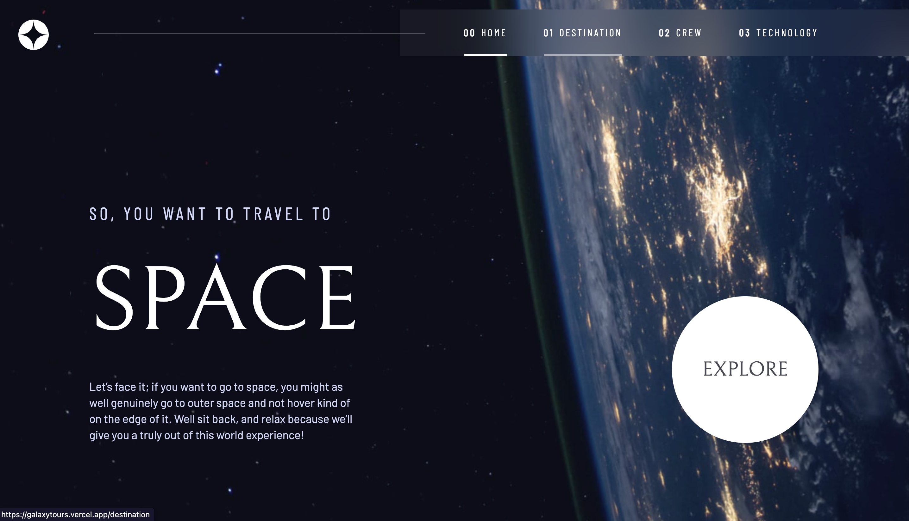

# Frontend Mentor - Space tourism website 

This is a solution to the [Space tourism website challenge on Frontend Mentor](https://www.frontendmentor.io/challenges/space-tourism-multipage-website-gRWj1URZ3). Frontend Mentor challenges help you improve your coding skills by building realistic projects. 

## Table of contents

  - [The challenge](#the-challenge)
  - [Screenshot](#screenshot)
  - [Links](#links)
  - [Built with](#built-with)

### The challenge

Users should be able to:

- View the optimal layout for each of the website's pages depending on their device's screen size
- See hover states for all interactive elements on the page
- View each page and be able to toggle between the tabs to see new information

### Screenshot

### Links

- Solution: [at Frontend Mentor](https://www.frontendmentor.io/solutions/fully-responsive-multipage-website-built-with-react-and-sass-Y0WrOKB84L)

- Live Site: [hosted on Vercel](https://galaxytours.vercel.app)

### Built with
- Mobile-first approach
- Flexbox
- CSS Grid
#### - Programming languages
- [React](https://reactjs.org/) - JS library
- [Framer Motion](https://www.framer.com/motion) - React library
- [SCSS](https://sass-lang.com/) - CSS Preprocessor

